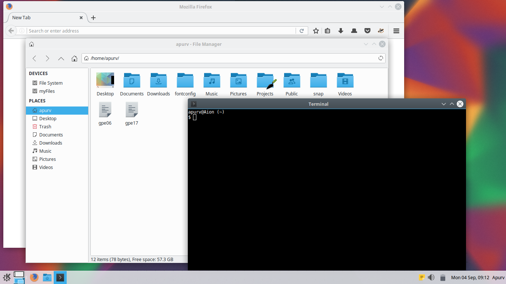

# Breeze-xfce
This is a Plasma's Breeze inspired theme for Xfce desktop.

*Feel free to fork and modify this theme.*

## Original authors
Xfwm theme has been forked from [this](https://github.com/psy-q/xfwm-theme-breeze/) project.
GTK theme has been forked from [here](https://github.com/dirruk1/gnome-breeze/).

## Installation
Download the zip file, extract it and,
1. For single user access, copy the files to '~/.themes':
> cp -r Breeze-xfce ~/.themes/

2. For system wide access to the theme, copy it to '/usr/share/themes/'
> sudo cp -r Breeze-xfce /usr/share/themes

